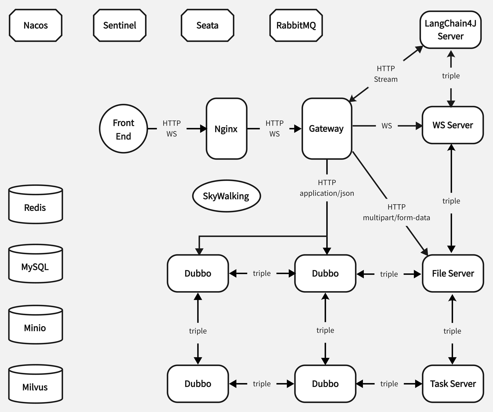

# sp817-project-starter

## 1. 项目介绍

本项目为快速搭建基于SpringBoot、Dubbo微服务架构的后端系统而设计，能够帮助团队高效完成开发任务。

## 2. 项目依赖

本项目 依赖于 **sp817-springboot3-dubbo3-dependency**

**核心：** `JDK21`，`Dubbo3.3.4`，`SpringBoot3.4.2`，`sa-token1.42.0`，`nacos`

**中间件：** `Redis`，`MySQL`，`MybatisPlus`，`Langchain4j`

**工具包：** `lombok`，`commons-lang3`，`pinyin4j`，`knife4j`，`jackson`

**日志：** `log4j2`

## 3. 使用方法

1. clone 该仓库 [shinpu1817/sp817-springboot3-dubbo3-dependency](https://github.com/shinpu1817/sp817-springboot3-dubbo3-dependency) 用 `mvn install` 打包到本地仓库‘
2. 修改微服务下的各个配置项
3. 部分配置请配置于Nacos中，如Redis，MySQL的相关配置

## 4. 项目结构
**_project_document_synthesize_**：Knife4J提供聚合文档，用于前端的接口请求生成。

**common** ：存放所有微服务资源，例如统一返回结果类，常量类，工具类，自定义注解，自定义异常等资源，source目录微服务的实体类，mapper，service，工具类。

**gateway**：项目的入口，在这里进行统一认证鉴权。

**UserStore**：用户微服务

**Provider**：当前测试使用的子服务，被UserStore调用

### 5. 特性介绍

1. 网关统一认证鉴权：不在gateway做数据查询，而是通过rpc转发到鉴权服务
    - 用户请求被gateway中的认证鉴权拦截器拦截
    - 从数据库中获取被拦截路由所对应的权限码 target-code，拦截级别 level
    - 获取不到直接不允许通过，获取到则进行下一步，若level对应不需要认证直接放行
    - 否则校验用户是否已登录，未登录401
    - 若已经登录，则通过RBAC模型获取该用户的codeList，判断 target-code 是否再其中
    - 在则放行，不在则403

---
